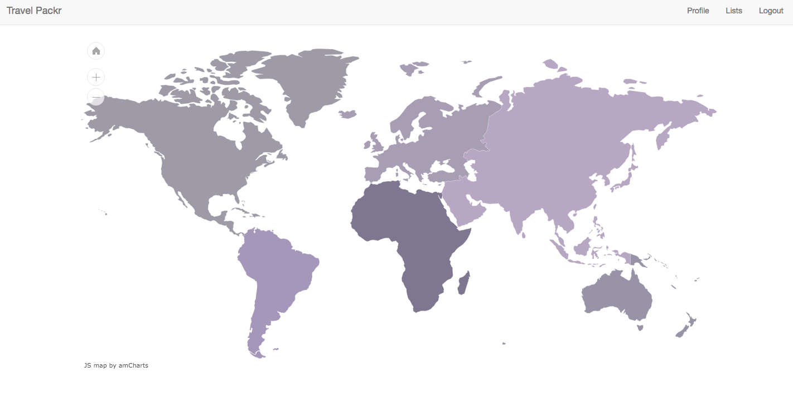
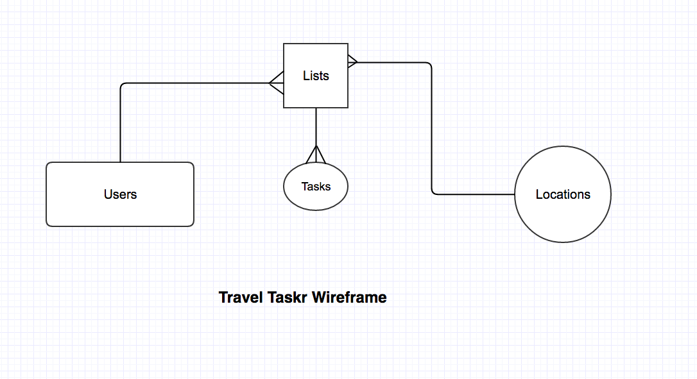

# Travel Packr

Travel Packr is an application where users can create travel packing lists that are specific to a city. Users have the capability to copy other users lists and make them their own. Lists can be accessed from the home map page when the user clicks on a specific city, the page then redirects to all the lists pertaining to the city that was clicked. This app allows for facebook login and commenting, and contains an admin feature. The admin has the ability to create locations, and perform full crud on users and lists.  

---

#### Technologies Used:
- Node.JS
- jQuery
- JavaScript
- HTML
- Bootstrap
- Facebook API
- AM Charts
- Mongoose
- MLab
- Heroku
- AJAX

#### NPM Packages Used:
- bcrypt-nodejs
- body-parser
- connect-flash
- connect-mongodb-session
- cookie-parser
- dotenv
- ejs
- express
- express-ejs-layouts
- express-session
- method-override
- mongoose
- morgan
- passport
- passport-facebook
- passport-local

---

#### Installation Instructions:

1. Go to github and copy the repositories clone url.
2. Go to your terminal and do a ``git clone`` "the copied repo's url"

##TRELLO:
[Trello](https://trello.com/b/baQJxAnw/project-three-task-app)

##Wireframes:

###Major hurdles and unsolved problems:
- getting the facebook api to fully function... It creates a new user every time you log in.
- being able to access the map and link it to the list
- having a global modal where users can make lists from everywhere~ this issue has not yet been solved
